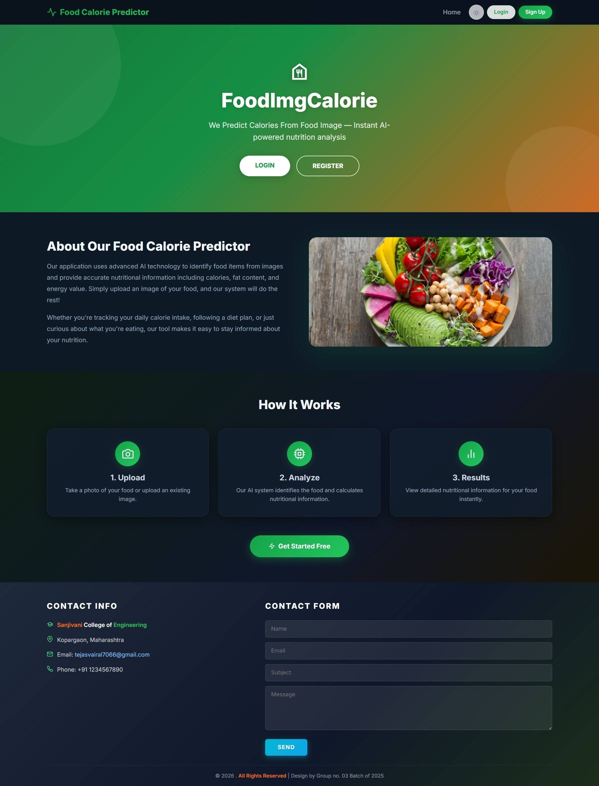
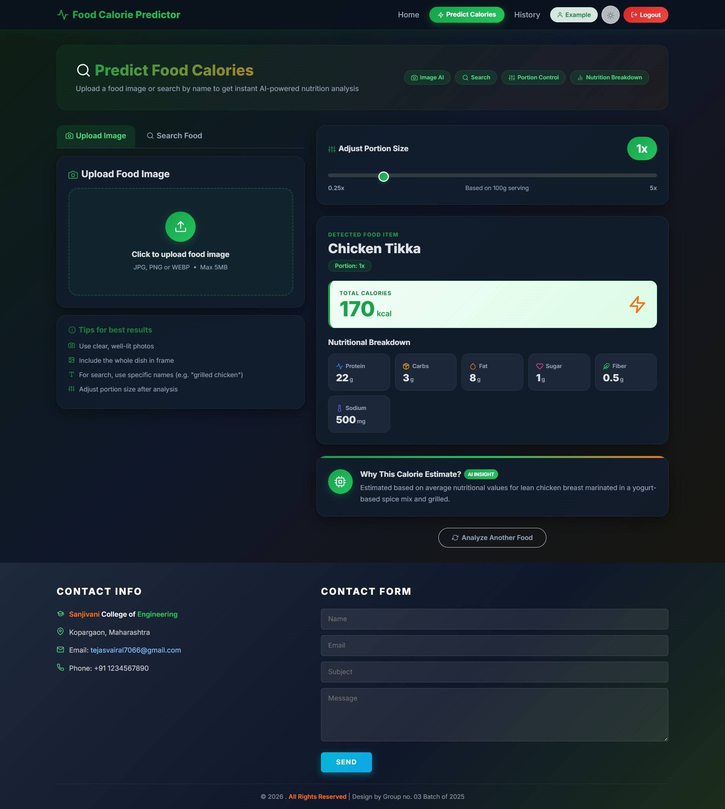
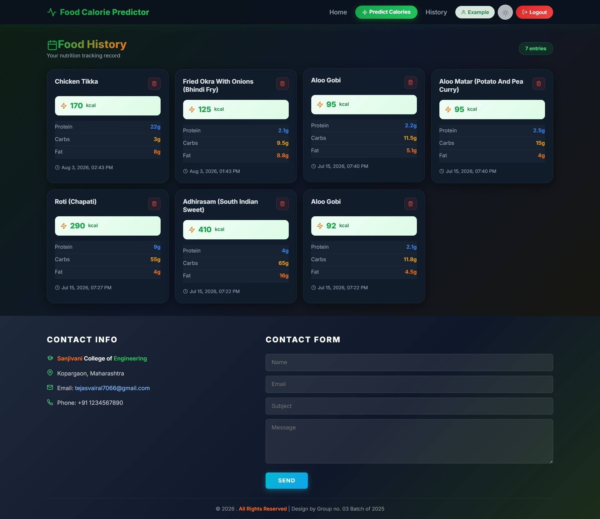
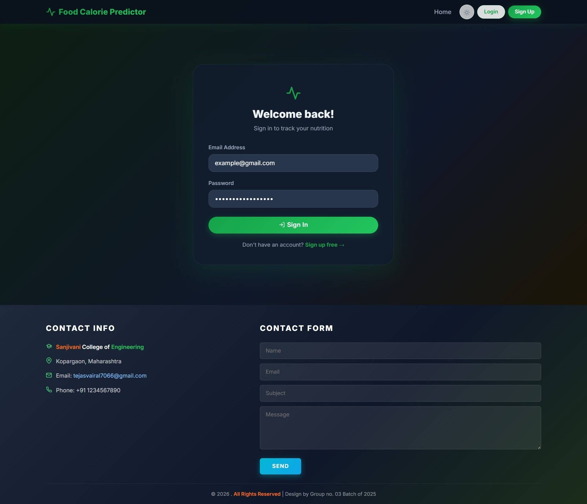

<div align="center">

# 🍽️ Food Image Recognition & Calorie Prediction

### *Instant AI-powered nutrition analysis from food images*

[](https://nodejs.org/)
[](https://reactjs.org/)
[](https://www.mongodb.com/)
[](https://deepmind.google/technologies/gemini/)
[](LICENSE)

> A full-stack MERN application that leverages **Google Gemini AI** to identify food from images and deliver instant, detailed nutritional breakdowns — calories, protein, carbs, fat, and more.

</div>

---

## 📸 Application Screenshots

<table>
  <tr>
    <td align="center"><b>🏠 Home / Landing Page</b></td>
    <td align="center"><b>🔬 Predict Calories</b></td>
  </tr>
  <tr>
    <td></td>
    <td></td>
  </tr>
  <tr>
    <td align="center"><b>📜 Food History</b></td>
    <td align="center"><b>🔐 Login / Register</b></td>
  </tr>
  <tr>
    <td></td>
    <td></td>
  </tr>
</table>


---

## 📖 Table of Contents

- [About the Project](#-about-the-project)
- [Key Features](#-key-features)
- [Tech Stack](#️-tech-stack)
- [Project Structure](#-project-structure)
- [Prerequisites](#-prerequisites)
- [Installation & Setup](#️-installation--setup)
- [Environment Variables](#-environment-variables)
- [Running the Project](#-running-the-project)
- [API Reference](#-api-reference)
- [Usage Examples](#-usage-examples)
- [How It Works](#️-how-it-works)
- [Deployment](#-deployment)
- [Contributing](#-contributing)
- [License](#-license)
- [Authors & Acknowledgments](#-authors--acknowledgments)

---

## 🎯 About the Project

**Food Image Recognition & Calorie Prediction** is an intelligent, web-based nutrition assistant that removes the guesswork from healthy eating. Users can either **upload a photo** of their food or **search by name** to instantly receive a full nutritional breakdown powered by Google Gemini AI.

Every meal analyzed is automatically saved to a personal **Food History**, allowing users to monitor their intake over time, adjust portion sizes with a real-time slider, and make informed dietary choices — all from a clean, responsive dark-themed interface.

This project was developed as a final-year engineering project at **Sanjivani College of Engineering**, Kopargaon, Maharashtra, by Group No. 03 (Batch of 2025).

---

## ✨ Key Features

### 🤖 AI-Powered Analysis
| Feature | Description |
|---|---|
| 📸 **Image Recognition** | Upload any food photo (JPG, PNG, WEBP ≤ 5 MB) for instant Gemini AI analysis |
| 🔍 **Food Name Search** | Search any food by name to retrieve nutrition facts |
| 📊 **Full Nutrition Breakdown** | Calories, protein, carbohydrates, fat, sugar, fiber, and sodium |
| 🎚️ **Portion Size Control** | Real-time slider adjusts all values from 0.25× to 5× |
| 💡 **AI Explanation** | Understand how the calorie estimate was derived |

### 👤 User Features
| Feature | Description |
|---|---|
| 🔐 **JWT Authentication** | Secure signup and login with bcrypt-hashed passwords |
| 📜 **Food History Log** | View, browse, and delete all previously analyzed meals |
| 🌙 **Dark / Light Mode** | Eye-friendly theme toggle persisted across sessions |
| 📱 **Responsive Design** | Fully functional on mobile, tablet, and desktop |

### 🛡️ Admin Features
| Feature | Description |
|---|---|
| 👥 **User Management** | View all registered users and their activity |
| 📊 **Dashboard Statistics** | System-wide analytics and usage data |
| 🗑️ **Data Management** | Delete users and associated food logs |

---

## 🛠️ Tech Stack

| Layer | Technology | Version |
|---|---|---|
| **Frontend** | React | 18 |
| **Build Tool** | Vite | 5 |
| **UI Framework** | Bootstrap + React-Bootstrap | 5.3 |
| **Routing** | React Router DOM | 6 |
| **HTTP Client** | Axios | 1.6 |
| **Backend** | Node.js + Express.js | 18+ / 4.18 |
| **Database** | MongoDB + Mongoose | 8.1 |
| **AI Service** | Google Gemini API (`@google/genai`) | 1.42 |
| **Authentication** | JSON Web Tokens (JWT) | 9 |
| **Password Hashing** | bcryptjs | 2.4 |
| **Image Upload** | Multer | 1.4 |
| **Image Processing** | Sharp | 0.33 |
| **Validation** | express-validator | 7 |

---

## 📁 Project Structure

```
Food Image Recognization and Calories Predication/
│
├── backend/                        # Express.js REST API
│   ├── config/                     # DB & Gemini API configuration
│   ├── controllers/                # Route handler logic (MVC)
│   ├── middleware/                 # Auth guard, file upload, error handling
│   ├── models/                     # Mongoose schemas (User, FoodLog)
│   ├── routes/                     # API route definitions
│   ├── services/                   # Business logic (Gemini, image processing)
│   ├── uploads/                    # Temporary file storage
│   ├── utils/                      # Shared helper functions
│   ├── .env.example                # Environment variable template
│   └── server.js                   # Application entry point
│
├── frontend/                       # React + Vite SPA
│   ├── src/
│   │   ├── components/             # Reusable UI components (Navbar, Cards, etc.)
│   │   ├── context/                # Auth & Theme React contexts
│   │   ├── pages/                  # Page-level components (Home, Predict, History)
│   │   ├── services/               # Axios API service functions
│   │   ├── styles/                 # Global and component-level CSS
│   │   ├── utils/                  # Constants & utility helpers
│   │   ├── App.jsx                 # Root component with routing
│   │   └── main.jsx                # React DOM entry point
│   ├── index.html                  # HTML shell
│   ├── vite.config.js              # Vite build configuration
│   └── .env.example                # Frontend environment template
│
└── docs/                           # Project documentation
    ├── API_DOCUMENTATION.md        # Detailed API reference
    ├── DEPLOYMENT_GUIDE.md         # Deployment instructions
    ├── SETUP_GUIDE.md              # Detailed setup guide
    ├── VIVA_QUESTIONS.md           # Interview / viva preparation
    └── screenshots/                # Application screenshots
```

---

## ✅ Prerequisites

Ensure the following tools are installed on your system before proceeding:

| Requirement | Minimum Version | Download |
|---|---|---|
| **Node.js** | v18.0+ | [nodejs.org](https://nodejs.org/) |
| **npm** | v9.0+ | Bundled with Node.js |
| **MongoDB** | Local or Atlas | [mongodb.com](https://www.mongodb.com/) |
| **Google Gemini API Key** | — | [Get API Key](https://makersuite.google.com/app/apikey) |
| **Git** | Any | [git-scm.com](https://git-scm.com/) |

---

## ⚙️ Installation & Setup

### 1. Clone the Repository

```bash
git clone https://github.com/your-username/food-calorie-predictor.git
cd food-calorie-predictor
```

### 2. Backend Setup

```bash
# Navigate to the backend directory
cd backend

# Install all dependencies
npm install

# Copy the environment variable template
cp .env.example .env
```

Now open `.env` and fill in your values (see [Environment Variables](#-environment-variables)).

```bash
# Start the backend development server
npm run dev
```

The API server will be live at **`http://localhost:5000`**

---

### 3. Frontend Setup

Open a **new terminal** and run:

```bash
# Navigate to the frontend directory
cd frontend

# Install all dependencies
npm install

# Copy the environment variable template
cp .env.example .env
```

Edit the `.env` file:

```env
VITE_API_URL=http://localhost:5000/api
```

```bash
# Start the frontend development server
npm run dev
```

The application will open at **`http://localhost:5173`**

---

## 🔐 Environment Variables

### Backend (`backend/.env`)

```env
# Server
PORT=5000
NODE_ENV=development

# MongoDB (use Atlas free tier or local instance)
MONGODB_URI=mongodb+srv://<username>:<password>@cluster.mongodb.net/food-recognition?retryWrites=true&w=majority

# JWT — use a long, random string in production
JWT_SECRET=your_super_secret_jwt_key_change_this_in_production

# Google Gemini AI
GEMINI_API_KEY=your_gemini_api_key_here

# CORS — must match the frontend URL exactly
FRONTEND_URL=http://localhost:5173

# Upload limit (bytes) — default 5 MB
MAX_FILE_SIZE=5242880
```

### Frontend (`frontend/.env`)

```env
VITE_API_URL=http://localhost:5000/api
```

> ⚠️ **Never commit `.env` files to version control.** Both `.env` files are already listed in `.gitignore`.

---

## 🚀 Running the Project

| Command | Directory | Description |
|---|---|---|
| `npm run dev` | `backend/` | Start backend with hot-reload (nodemon) |
| `npm start` | `backend/` | Start backend in production mode |
| `npm run dev` | `frontend/` | Start Vite dev server with HMR |
| `npm run build` | `frontend/` | Build optimized production bundle |
| `npm run preview` | `frontend/` | Preview the production build locally |

> 💡 **Tip:** Run both servers simultaneously in separate terminal windows or use a process manager like `pm2` or `concurrently`.

---

## 📚 API Reference

### Authentication Endpoints

| Method | Endpoint | Auth Required | Description |
|---|---|---|---|
| `POST` | `/api/auth/signup` | ❌ | Register a new user account |
| `POST` | `/api/auth/login` | ❌ | Authenticate and receive JWT token |
| `GET` | `/api/auth/me` | ✅ | Fetch the currently authenticated user |

### Food Endpoints

| Method | Endpoint | Auth Required | Description |
|---|---|---|---|
| `POST` | `/api/food/analyze` | ✅ | Upload a food image for AI analysis |
| `POST` | `/api/food/search` | ✅ | Search food by name for nutrition data |
| `GET` | `/api/food/history` | ✅ | Retrieve the user's food log history |
| `GET` | `/api/food/:id` | ✅ | Get details of a specific food log entry |
| `DELETE` | `/api/food/:id` | ✅ | Delete a specific food log entry |

### Admin Endpoints *(Admin role required)*

| Method | Endpoint | Auth Required | Description |
|---|---|---|---|
| `GET` | `/api/admin/users` | ✅ Admin | List all registered users |
| `GET` | `/api/admin/logs` | ✅ Admin | List all food logs across users |
| `GET` | `/api/admin/stats` | ✅ Admin | Get system-wide statistics |
| `DELETE` | `/api/admin/users/:id` | ✅ Admin | Delete a user and their data |

> 📄 For full request/response schemas, see [`docs/API_DOCUMENTATION.md`](docs/API_DOCUMENTATION.md).

---

## 💡 Usage Examples

### Analyze a Food Image (cURL)

```bash
curl -X POST http://localhost:5000/api/food/analyze \
  -H "Authorization: Bearer <your_jwt_token>" \
  -F "image=@/path/to/chicken_tikka.jpg"
```

**Sample Response:**
```json
{
  "success": true,
  "data": {
    "foodName": "Chicken Tikka",
    "calories": 170,
    "nutrition": {
      "protein": 22,
      "carbs": 3,
      "fat": 8,
      "sugar": 1,
      "fiber": 0.5,
      "sodium": 500
    },
    "explanation": "Estimated based on average nutritional values for lean chicken breast marinated in a yogurt-based spice mix and grilled.",
    "portion": "100g"
  }
}
```

### Search Food by Name (cURL)

```bash
curl -X POST http://localhost:5000/api/food/search \
  -H "Authorization: Bearer <your_jwt_token>" \
  -H "Content-Type: application/json" \
  -d '{"foodName": "Roti Chapati"}'
```

### Register a New User (cURL)

```bash
curl -X POST http://localhost:5000/api/auth/signup \
  -H "Content-Type: application/json" \
  -d '{
    "fullName": "Tejas Vairal",
    "email": "tejasvairal7066@gmail.com",
    "password": "SecurePassword123"
  }'
```

---

## ⚙️ How It Works

```
              User Action
                   │
                   ▼
┌─────────────────────────────────────────┐
│  1. Upload Image  or  Search by Name    │
└──────────────────┬──────────────────────┘
                   │
                   ▼
┌─────────────────────────────────────────┐
│  2. Backend receives request            │
│     → Multer handles file upload        │
│     → Sharp compresses the image        │
└──────────────────┬──────────────────────┘
                   │
                   ▼
┌─────────────────────────────────────────┐
│  3. Google Gemini AI processes request  │
│     → Food item identified              │
│     → Nutritional data extracted        │
│     → Explanation generated             │
└──────────────────┬──────────────────────┘
                   │
                   ▼
┌─────────────────────────────────────────┐
│  4. Data saved to MongoDB               │
│     → Food log entry created            │
│     → Linked to authenticated user      │
└──────────────────┬──────────────────────┘
                   │
                   ▼
┌─────────────────────────────────────────┐
│  5. Results displayed to user           │
│     → Nutrition cards with all macros   │
│     → Portion size slider (0.25x – 5x)  │
│     → Saved to Food History             │
└─────────────────────────────────────────┘
```

---

## 🌐 Deployment

### Recommended Hosting Stack

| Service | Purpose | Free Tier |
|---|---|---|
| [MongoDB Atlas](https://www.mongodb.com/cloud/atlas) | Database hosting | ✅ 512 MB |
| [Render](https://render.com) | Backend API hosting | ✅ Available |
| [Vercel](https://vercel.com) | Frontend hosting | ✅ Available |

### Quick Deployment Steps

**1. Database — MongoDB Atlas**
```
1. Create a free account at mongodb.com/cloud/atlas
2. Create a new cluster (M0 free tier)
3. Whitelist your IP (or 0.0.0.0/0 for all IPs)
4. Create a database user and copy the connection string
5. Set MONGODB_URI in your backend environment variables
```

**2. Backend — Render**
```
1. Push your code to a GitHub repository
2. Create a Render account and click "New Web Service"
3. Connect your GitHub repo; set root directory to backend/
4. Build Command:  npm install
5. Start Command:  npm start
6. Add all environment variables from backend/.env
7. Click Deploy
```

**3. Frontend — Vercel**
```
1. Import your GitHub repository on vercel.com
2. Set the Root Directory to frontend/
3. Add VITE_API_URL pointing to your Render backend URL
4. Click Deploy
```

> 📘 See [`docs/DEPLOYMENT_GUIDE.md`](docs/DEPLOYMENT_GUIDE.md) for a detailed step-by-step walkthrough.

---

## 🤝 Contributing

Contributions are welcome! Here's how to get involved:

1. **Fork** the repository on GitHub
2. **Create** a feature branch
   ```bash
   git checkout -b feature/your-feature-name
   ```
3. **Commit** your changes with a clear message
   ```bash
   git commit -m "feat: add barcode scanning for packaged foods"
   ```
4. **Push** to your fork
   ```bash
   git push origin feature/your-feature-name
   ```
5. **Open** a Pull Request against the `main` branch

### Contribution Guidelines

- Follow the existing code style and folder structure
- Write clear commit messages using [Conventional Commits](https://www.conventionalcommits.org/)
- Ensure the application runs without errors before submitting a PR
- For major changes, please open an issue first to discuss your proposal

### Ideas for Future Improvements

- 🔖 Barcode scanning for packaged / processed products
- 📈 Daily and weekly calorie goal tracking with charts
- 🌐 Multi-language / regional food database support
- 📤 Export food history as PDF or CSV
- 📷 Real-time camera capture support in the browser

---

## 📄 License

This project is distributed under the **MIT License**.

```
MIT License

Copyright (c) 2025 Group No. 03 — Sanjivani College of Engineering

Permission is hereby granted, free of charge, to any person obtaining a copy
of this software and associated documentation files (the "Software"), to deal
in the Software without restriction, including without limitation the rights
to use, copy, modify, merge, publish, distribute, sublicense, and/or sell
copies of the Software, and to permit persons to whom the Software is
furnished to do so, subject to the following conditions:

The above copyright notice and this permission notice shall be included in all
copies or substantial portions of the Software.

THE SOFTWARE IS PROVIDED "AS IS", WITHOUT WARRANTY OF ANY KIND, EXPRESS OR
IMPLIED, INCLUDING BUT NOT LIMITED TO THE WARRANTIES OF MERCHANTABILITY,
FITNESS FOR A PARTICULAR PURPOSE AND NONINFRINGEMENT.
```

See the full [`LICENSE`](LICENSE) file for details.

---

## 👨‍💻 Authors & Acknowledgments

**Developed by Group No. 03 — Batch of 2025**

🏫 **Sanjivani College of Engineering**, Kopargaon, Maharashtra

📧 **Contact:** tejasvairal7066@gmail.com
📞 **Phone:** +91 1234567890

---

### 🙏 Acknowledgments

- **[Google Gemini AI](https://deepmind.google/technologies/gemini/)** — for powering food recognition and nutritional analysis
- **[MongoDB](https://www.mongodb.com/)** — for the flexible, scalable NoSQL database
- **[React](https://reactjs.org/)** — for the fast, component-based UI framework
- **[Bootstrap](https://getbootstrap.com/)** — for responsive UI components
- **[Vite](https://vitejs.dev/)** — for lightning-fast frontend build tooling
- **[Render](https://render.com/) & [Vercel](https://vercel.com/)** — for accessible, developer-friendly cloud hosting

---

<div align="center">

**⭐ If this project was helpful, please consider giving it a star on GitHub!**

*© 2026 · All Rights Reserved · Design by Group No. 03 Batch of 2025*

</div>
